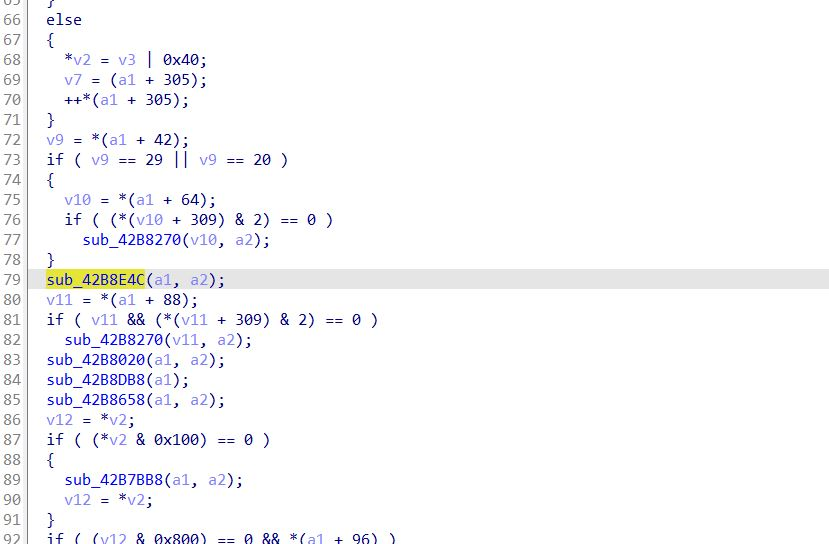

# 使用方法
frida-dump-il2cpp-class.js中需要修改il2cpp_api，InitLocked_pianyi，package_name这3个变量的值
il2cpp_api可通过 [frida-find-il2cpp-api](https://github.com/AndroidReverser-Test/frida-find-il2cpp-api)这个项目中的find-il2cpp-api2.js的注入来获取

InitLocked_pianyi则需要使用ida解析libil2cpp.so后，通过搜索字符串"' because generic types cannot have explicit layout."再查找其交叉引用定位到需要的函数附近

上图标黄处的函数地址即为需要的偏移

package_name即为包名

在正确修改上述偏移后即可通过frida spawn启动目标app注入脚本，待需要的class完全加载后，再主动调用get_class_info若无错误发生将会在/data/data/包名/files/下生成
class_info.log.